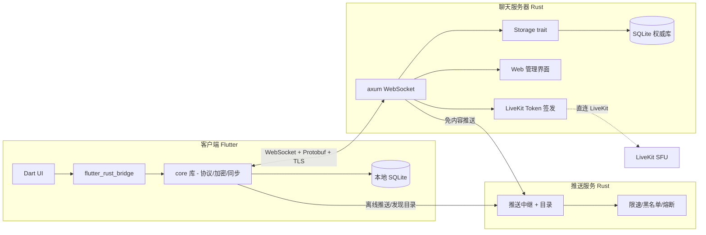

# LonIsle

LonIsle 是一款**跨端、分布式服务器架构**的即时聊天软件。与传统的中心化聊天软件不同，LonIsle 由大量**相互独立的服务器（Server）**组成，每个服务器即是一个群聊社区；客户端可直接连接一个或多个服务器，在不同社区间自由切换。

参考形态：Discord（服务器 + 频道）× Matrix（分布式 / 去中心化）。

## 架构



## 核心特性

- **分布式**：无中心聊天服务器，每个 Server 独立部署、独立存储
- **自主身份**：用户 ID 由客户端本地生成（Ed25519 主密钥对，公钥哈希为 ID），无需中心注册
- **多设备**：设备证书链认证（主密钥签发），支持设备授权/撤销/吊销传播
- **多服务器聚合**：客户端同时连接多个服务器，类 Discord 三栏 UI
- **端到端加密**：基于设备证书的 Signal 双棘轮（X3DH + X25519 + AES-GCM）
- **富媒体**：图片/视频/语音附件、@提及、Reaction、本地全文搜索
- **音视频**：LiveKit 音视频话题（SFU，服务器仅签发 Token）
- **机器人 API**：Bot 身份 + WebSocket 接入 + 事件订阅
- **推送与发现**：推送服务（限速/黑名单/熔断防滥用）+ 服务器发现目录

## 技术栈

| 层 | 选型 |
| --- | --- |
| 客户端 | Flutter + Rust core（flutter_rust_bridge） |
| 核心逻辑 | Rust core 共享库（协议/加密/签名/棘轮） |
| 聊天服务器 | Rust（tokio + axum + sqlx SQLite） |
| 推送服务 | Rust（与聊天服务器同栈） |
| 通信协议 | WebSocket + Protobuf（v1） |
| 存储 | SQLite（Storage trait 抽象，预留 PostgreSQL） |
| 身份 | Ed25519 主密钥对 + 设备证书链 + X25519（E2EE） |
| 音视频 | LiveKit（SFU） |

## 目录结构

```
lonisle/
├── core/            # Rust 共享库：协议、加密、签名、棘轮、助记词、密钥派生
├── server/          # 聊天服务器（WebSocket + 管理界面 + 附件 + LiveKit Token）
├── push/            # 推送服务（推送中继 + 目录 + 限速防滥用）
├── client/          # Flutter 客户端（UI + flutter_rust_bridge）
├── proto/           # Protobuf schema 唯一定义源
├── docker-compose.yml  # 一键部署（server + push + livekit）
├── livekit.yaml     # LiveKit 部署配置
└── REQUIREMENTS.md  # 需求文档
```

## 快速开始（Docker 部署）

```bash
# 一键启动聊天服务器 + 推送服务 + LiveKit
docker compose up -d

# 查看状态
docker compose ps
```

服务端口：

| 服务 | 端口 | 说明 |
| --- | --- | --- |
| 聊天服务器 | 8080 | WebSocket + 管理界面 |
| 推送服务 | 8081 | 推送 API + 管理界面 |
| LiveKit | 7880/7881/7882/5349/3478 | 音视频 |

**首次启动注意事项**：
- 聊天服务器首次启动会生成服务器密钥对（`server_id = 公钥哈希`），**请备份数据卷中的密钥**，丢失即身份失效
- 音视频话题需在聊天服务器管理界面（`http://<host>:8080`）配置 LiveKit 地址与 API Key/Secret

## 开发指南

### 构建服务端

```bash
# 构建聊天服务器
cargo build --release -p lonisle-server

# 构建推送服务
cargo build --release -p lonisle-push

# 运行测试
cargo test
```

### 构建客户端

```bash
cd client
flutter pub get
flutter_rust_bridge_codegen generate  # 重新生成桥接代码
flutter build macos --debug            # macOS 构建
```

### 协议代码生成

```bash
# 修改 proto/lonisle.proto 后：
# 1. Rust（core 库 build.rs 自动生成）
cargo build -p lonisle-core

# 2. Dart（客户端）
cd client
protoc --dart_out=lib/src/proto -I../proto ../proto/lonisle.proto
```

## 里程碑

| 阶段 | 内容 | 状态 |
| --- | --- | --- |
| M1 | 最小闭环（身份/单服务器/文本/双端存储） | ✅ |
| M2 | 完整群聊（多话题/审批/成员管理/资料覆盖） | ✅ |
| M3 | 多设备 + 多服务器（授权/撤销/聚合/重连/未读） | ✅ |
| M4 | 推送与发现（推送服务/限速/目录/发现页） | ✅ |
| M5 | 富功能（附件/@提及/Reaction/搜索/加密） | ✅ |
| M6 | 生态（机器人 API/自建推送工具链/端到端加密） | ✅ |
| P1 补全 | 数据管理/服务器治理/推送防滥用/邀请链接 | ✅ |
| P2 补全 | RBAC/已读回执/自动下载阈值/语音倍速 | ✅ |
| 音视频 | LiveKit 音视频话题 | ✅ |

## 协议说明

- 客户端与聊天服务器通过 WebSocket + Protobuf 通信（`proto/lonisle.proto`）
- 消息排序以服务器全局单调序号为准（客户端时间戳仅展示参考）
- 消息 ID 客户端生成 + 设备签名抗重放，服务器幂等去重
- Hello 握手携带协议版本号进行兼容协商

## 许可证

MIT
