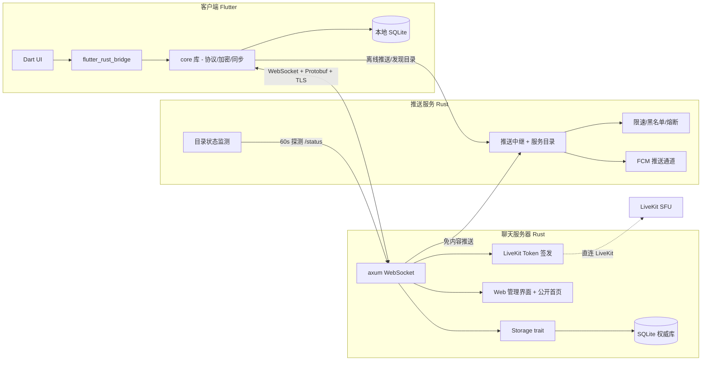

# LonIsle

LonIsle 是一款**跨端、分布式服务器架构**的即时聊天软件。与传统的中心化聊天软件不同，LonIsle 由大量**相互独立的服务器**（Server）组成，每个服务器即是一个群聊社区；客户端可直接连接一个或多个服务器，在不同社区间自由切换。

架构形态为**服务器 + 话题 + 自托管分布式**（社区/频道）：每个服务器独立部署、独立存储、独立治理，通过统一的推送与发现网络互联，服务器之间无中心依赖。

## 架构



## 核心特性

- **分布式**：无中心聊天服务器，每个 Server 独立部署、独立存储、独立治理
- **自主身份**：用户 ID 由客户端本地生成（Ed25519 主密钥对，公钥哈希为 ID），无需中心注册
- **多设备**：设备证书链认证（主密钥签发），支持设备授权/撤销/吊销传播
- **多服务器聚合**：客户端同时连接多个服务器，三栏布局（服务器栏 / 话题列表 / 消息区），断线自动重连
- **端到端加密**：基于设备证书的 Signal 双棘轮（X3DH + X25519 + AES-GCM），本地 SQLCipher 加密存储
- **富媒体**：图片/视频/语音附件（缩略图占位、下载后播放）、@提及、Reaction、消息编辑/删除、本地全文搜索
- **音视频**：LiveKit 音视频话题（SFU，服务器仅签发 Token）
- **机器人 API**：Bot 身份 + WebSocket 接入 + 事件订阅
- **推送与发现**：
  - **推送服务**：免内容推送中继（服务器仅传 `server_id + user_id + hint + title`，推送服务不接触消息内容）
  - **FCM 推送**：支持 **Firebase 服务账号（Admin SDK 同款，粘贴 JSON）与 OAuth2 Refresh Token** 两种凭证，Web 管理端配置、保存即热生效；Android 端前后台均可收到通知（前台走本地通知，后台走系统通知，白色 logo 单色图标）
  - **服务目录**：已上架服务器公开浏览（名称/简介/地址/加入策略/在线人数），推送服务每 60s 定时探测各服务器 `/status` 状态接口，接口异常自动标记离线
  - **接入治理**：服务器申请入列 → 管理员审核白名单 → 上架目录；限速 / 黑名单 / 熔断防滥用，健康检查失败自动暂停推送资格

## 技术栈

| 层 | 选型 |
| --- | --- |
| 客户端 | Flutter + Rust core（flutter_rust_bridge） |
| 核心逻辑 | Rust core 共享库（协议/加密/签名/棘轮） |
| 聊天服务器 | Rust（tokio + axum + sqlx SQLite，TLS） |
| 推送服务 | Rust（与聊天服务器同栈，FCM HTTP v1） |
| 通信协议 | WebSocket + Protobuf（v1） |
| 存储 | SQLite（Storage trait 抽象，预留 PostgreSQL） |
| 身份 | Ed25519 主密钥对 + 设备证书链 + X25519（E2EE） |
| 音视频 | LiveKit（SFU） |

## 目录结构

```
lonisle/
├── core/            # Rust 共享库：协议、加密、签名、棘轮、助记词、密钥派生
├── server/          # 聊天服务器（WebSocket + 公开首页 + 管理界面 + 附件 + LiveKit Token）
├── push/            # 推送服务（推送中继 + 服务目录 + 状态监测 + 限速防滥用）
├── client/          # Flutter 客户端（UI + flutter_rust_bridge）
├── proto/           # Protobuf schema 唯一定义源
├── docker-compose.yml  # 一键部署（server + push + livekit）
├── livekit.yaml     # LiveKit 部署配置
└── REQUIREMENTS.md  # 需求文档
```

## 快速开始（Docker 部署）

```bash
# 一键启动聊天服务器 + 推送服务 + LiveKit
docker compose up -d

# 查看状态
docker compose ps
```

服务端口：

| 服务 | 端口 | 说明 |
| --- | --- | --- |
| 聊天服务器 | 8080 | WebSocket + 公开首页 + 管理界面（HTTPS） |
| 推送服务 | 8081 | 推送 API + 公开目录页 + 管理界面（HTTPS，未配置证书时回退 HTTP） |
| LiveKit | 7880/7881/7882/5349/3478 | 音视频 |

**首次启动注意事项**：
- 聊天服务器首次启动会生成服务器密钥对（`server_id = 公钥哈希`），**请备份数据卷中的密钥**，丢失即身份失效
- 音视频话题需在聊天服务器管理界面（`https://<服务器地址>:8080/admin.html`）→ 高级 → LiveKit 配置服务地址与 API Key/Secret

## 使用说明

### 聊天服务器（server）
- **公开首页**（`/`）：展示服务器图标、名称、简介、在线人数/成员总数、加入策略；数据来自公开状态接口 `/status`，30s 自动刷新，接口异常显示「服务离线」
- **管理界面**（`/admin.html`，需管理 Token）：概览 / 审批 / 成员 / 话题 / 设置 / 高级（限速、LiveKit）/ Bot / 数据
- **话题管理**：创建（类型：普通/订阅/音视频；权限：公开/只读）、**编辑弹窗**（名称/描述/类型/权限/推送开关）、**↑↓ 排序**、删除
- **话题推送开关**：开启后该话题新消息会推送给服务器下所有客户端（`「话题」有新消息`）；**@提及推送不受开关控制，任何话题任何时候都会推送**（`在「话题」中被 @提及`）
- **TLS 证书**：默认自动生成自签证书（绑定服务器身份，客户端 TOFU 钉住指纹）；「高级设置」页可配置外部证书路径（如 Let's Encrypt），重启生效；两字段清空恢复自签
  > ⚠️ 更换证书后指纹变化，已连接客户端（TOFU 钉住旧指纹）需在设置中清除信任后重新连接

### 推送服务（push）
- **公开页**（`/`）：服务目录（浏览已上架服务器、复制地址、查看在线状态与人数）+ 申请入列（服务器自助提交白名单申请）
- **管理界面**（`/admin.html`，需管理 Key）：白名单审核 / 限速配置 / 运行模式（白/黑名单）/ 黑名单 / 目录管理 / FCM 推送
- **FCM 推送配置**：两种方式任选——方式一粘贴 Firebase 服务账号 JSON（推荐），方式二填 OAuth2 四项凭证；保存即热生效，无需重启
- **证书配置（HTTPS）**：管理端「证书配置」页填写证书/私钥 PEM 文件路径（如 Let's Encrypt 的 fullchain.pem / privkey.pem），保存后重启服务即启用 HTTPS；两字段同时清空则回退 HTTP。也可用环境变量 `TLS_CERT` / `TLS_KEY` 或命令行参数指定
- **目录状态监测**：每 60s 探测目录内服务器的 `/status`（HTTPS 优先，自签证书跳过校验），动态同步名称/简介/加入策略/在线人数，接口报错标记离线

### 接入推送网络流程
1. 新服务器运维者打开推送服务公开页 → **申请入列**（填服务器 ID、描述、健康检查地址 `https://host:8080/status`，需返回 200）
2. 管理员在推送服务管理页 **白名单** 审核通过
3. 服务器调用 `/directory/register` 上架目录
4. 用户打开推送服务公开页 **服务目录** 浏览并复制地址加入

## 开发指南

### 构建服务端

```bash
# 构建聊天服务器
cargo build --release -p lonisle-server

# 构建推送服务
cargo build --release -p lonisle-push

# 运行测试
cargo test
```

> 前置依赖：仅需 Rust 工具链。protoc 由 `protoc-bin-vendored` 在构建时自动下载（见 `core/Cargo.toml`），无需系统安装。

### CI 交叉编译（GitHub Actions）

`.github/workflows/build-binaries.yml` 通过 GitHub Actions 矩阵编译两个服务的可执行文件，覆盖 6 个目标平台：

| 目标平台 | 构建方式 |
| --- | --- |
| Windows x64（x86_64-pc-windows-msvc） | Windows runner 原生编译 |
| Windows ARM64（aarch64-pc-windows-msvc） | LLVM 交叉编译（clang-cl + llvm-lib + lld-link，使用 runner 自带 VS/Windows SDK） |
| Linux x64（x86_64-unknown-linux-gnu） | Ubuntu runner 原生编译 |
| Linux ARM64（aarch64-unknown-linux-gnu） | gcc-aarch64-linux-gnu 交叉编译 |
| macOS ARM64（aarch64-apple-darwin） | macOS runner 原生编译 |
| macOS x86_64（x86_64-apple-darwin） | clang 交叉编译 |

触发方式：

- **手动**：仓库 Actions 页面 → 本 workflow → Run workflow
- **发布**：推送 `v*` tag（如 `git tag v0.1.0 && git push origin v0.1.0`），构建后自动打包 12 个 zip 并发布 GitHub Release

产物命名：`lonisle-server-<target>.zip` / `lonisle-push-<target>.zip`（zip 内为单个可执行文件，Web 资源已通过 rust-embed 内嵌）。

> 注：`server/build.rs` 与 `push/build.rs` 使用纯 Rust 生成版本号（UTC 时间 `YYYYMMDDHHMM`），不再依赖 `date` 命令，Windows 亦可编译。

### 使用编译产物启动（二进制部署）

无需安装 Rust 环境。从 **GitHub Release**（推送 `v*` tag 自动生成）或 **Actions Artifacts**（手动触发后下载）获取对应平台的 zip，解压即用——zip 内为单个可执行文件，Web 资源已通过 rust-embed 内嵌。

```bash
# Linux / macOS：解压并赋执行权限
unzip lonisle-server-<target>.zip
chmod +x lonisle-server

# Windows：解压 lonisle-server.exe 后可直接运行（cmd / PowerShell）
```

**聊天服务器 lonisle-server**

```bash
./lonisle-server --listen 0.0.0.0:8080 --data-dir ./data --name "我的服务器"
```

| 参数 | 默认值 | 说明 |
| --- | --- | --- |
| `--listen` | `127.0.0.1:8080` | 监听地址（公网部署用 `0.0.0.0:8080`） |
| `--data-dir` | `./data` | 数据目录（密钥、SQLite 数据库） |
| `--name` / `--description` | `LonIsle Server` / 空 | 服务器显示名称 / 简介 |
| `--admin-token` | 自动生成 | 管理 API Token（env `LONISLE_ADMIN_TOKEN`；缺省自动生成并打印一次） |
| `--tls-cert` / `--tls-key` | 自签 | 外部证书 PEM 路径（env `TLS_CERT` / `TLS_KEY`；留空自动生成自签证书） |
| `--bot-token` | 空 | Bot Token（启用 Bot 认证） |
| `--backup-key` / `--restore-key` | - | 服务器密钥备份 / 恢复路径 |
| `--backup-passphrase` | 空 | 备份口令（env `LONISLE_BACKUP_PASSPHRASE`） |
| `--log-retain-days` | `7` | 日志文件保留天数（env `LOG_RETAIN_DAYS`） |

**推送服务 lonisle-push**

```bash
./lonisle-push --listen 0.0.0.0:8081 --data-dir ./data --admin-key "管理Key"
```

| 参数 | 默认值 | 说明 |
| --- | --- | --- |
| `--listen` | `127.0.0.1:8081` | 监听地址（env `LISTEN`） |
| `--data-dir` | `./data` | 数据目录（env `DATA_DIR`） |
| `--rate-per-minute` | `2` | 每 IP 每分钟请求数上限（env `RATE_PER_MINUTE`） |
| `--admin-key` | 空 | 管理界面 Key（env `PUSH_ADMIN_KEY`） |
| `--fcm-project-id` / `--fcm-client-id` / `--fcm-client-secret` / `--fcm-refresh-token` | 空 | FCM OAuth2 四项凭证（env `FCM_*`；也可在管理界面粘贴服务账号 JSON） |
| `--fcm-service-account` | 空 | FCM 服务账号 JSON 路径（env `FCM_SERVICE_ACCOUNT`；非空时优先于 OAuth2 方式） |
| `--tls-cert` / `--tls-key` | 空 | 证书 PEM 路径（env `TLS_CERT` / `TLS_KEY`；留空回退 HTTP） |
| `--log-retain-days` | `7` | 日志文件保留天数（env `LOG_RETAIN_DAYS`） |

> 运行 `./lonisle-server --help` / `./lonisle-push --help` 可查看全部参数。
> ⚠️ 首次启动会生成服务器密钥对（`server_id = 公钥哈希`），请备份 `data_dir` 中的密钥，丢失即身份失效。

**日志**：stdout（终端 / docker logs）与文件双输出。文件按天轮转写入 `{data_dir}/logs/{服务名}.{日期}.log`，保留 `LOG_RETAIN_DAYS` 天（默认 7，0 = 不删除）；级别由 `RUST_LOG` 控制（默认 `info,tower_http=warn`）。两个服务的**管理界面均新增「日志」页**（服务器 `/admin.html`、推送 `/admin.html`），实时查看最新日志。

### 构建客户端

```bash
cd client
flutter pub get
flutter_rust_bridge_codegen generate  # 重新生成桥接代码
flutter build macos --debug            # macOS 构建
```

> Android 构建需要 `client/android/app/google-services.json`（Firebase 配置，含 API Key，不入库）。参照同目录 `google-services.json.example` 填写你的 Firebase 项目信息。

### 协议代码生成

```bash
# 修改 proto/lonisle.proto 后：
# 1. Rust（core 库 build.rs 自动生成）
cargo build -p lonisle-core

# 2. Dart（客户端）
cd client
protoc --dart_out=lib/src/proto -I../proto ../proto/lonisle.proto
```

## 里程碑

| 阶段 | 内容 | 状态 |
| --- | --- | --- |
| M1 | 最小闭环（身份/单服务器/文本/双端存储） | ✅ |
| M2 | 完整群聊（多话题/审批/成员管理/资料覆盖） | ✅ |
| M3 | 多设备 + 多服务器（授权/撤销/聚合/重连/未读） | ✅ |
| M4 | 推送与发现（推送服务/限速/目录/发现页） | ✅ |
| M5 | 富功能（附件/@提及/Reaction/搜索/加密） | ✅ |
| M6 | 生态（机器人 API/自建推送工具链/端到端加密） | ✅ |
| P1 补全 | 数据管理/服务器治理/推送防滥用/邀请链接 | ✅ |
| P2 补全 | RBAC/已读回执/自动下载阈值/语音倍速 | ✅ |
| 音视频 | LiveKit 音视频话题 | ✅ |
| 推送增强 | FCM 双凭证/目录状态监测/话题推送开关/@提及推送 | ✅ |

## 协议说明

- 客户端与聊天服务器通过 WebSocket + Protobuf 通信（`proto/lonisle.proto`），TLS 加密
- 消息排序以服务器全局单调序号为准（客户端时间戳仅展示参考）
- 消息 ID 客户端生成 + 设备签名抗重放，服务器幂等去重
- Hello 握手携带协议版本号进行兼容协商
- 聊天服务器与推送服务之间：服务器使用 Ed25519 私钥对推送请求签名，推送服务验签后按白名单/限速/免打扰规则转发，全程不接触消息内容

## 许可证

MIT
